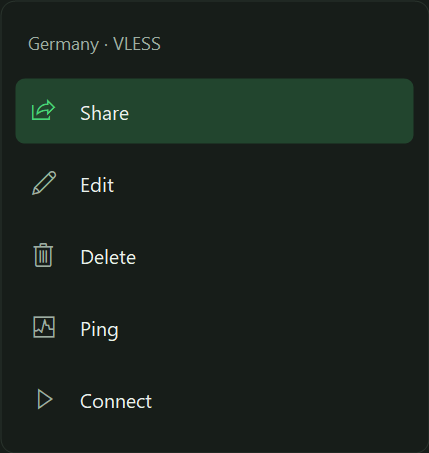

# Melavo VPN

A Windows VPN client with a modern English/Persian interface, powered by Xray and sing-box.

## Download

Download the **Customer ZIP** from [Releases](https://github.com/sirvan1133/MelavoClient/releases/latest), extract it, and run `MelavoClient.exe`. Windows 10/11 x64 is required. The app requests administrator rights for TUN.

Customer packages start empty: no subscriptions or configurations are included.

## Features

- Separate subscriptions and single configurations.
- VLESS, VMess, Trojan links and Xray JSON import.
- Ctrl+V imports a single configuration or opens a subscription form with its URL filled in.
- Subscription editing with automatic updates at startup and hourly; manual updates remain available.
- Text and QR sharing using standard proxy links for supported configurations.
- Animated configuration menu: Share, Edit, Delete, Ping, Connect.
- Tunnel latency, traffic metrics, search, favorites, and dark/light themes.
- English and Persian interface.



## Data storage

Customer data is stored under `data/MelavoClient-Customer` next to the executable. Subscriptions use Windows DPAPI encryption and are tied to the Windows account. Keep the extracted app in a writable folder. Legacy system-cache subscriptions are not automatically imported.

## Build

Install the .NET 8 SDK on Windows:

```powershell
dotnet build -c Release -p:CustomerEdition=true
dotnet publish -c Release -r win-x64 --self-contained true -p:PublishSingleFile=true -p:IncludeNativeLibrariesForSelfExtract=true -p:CustomerEdition=true -o publish
```

The source does not bundle third-party engine binaries. Copy the `core` folder from a Customer release alongside the built executable. Third-party license files are included in that folder.

Offline interface checks:

```powershell
dotnet .\bin\Release\net8.0-windows\MelavoClient.dll --ui-checks
```

## فارسی

فایل ZIP نسخهٔ Customer را از بخش Releases دریافت و استخراج کنید. برنامه بدون ساب و کانفیگ آمادهٔ تحویل به مشتری است. در تب کانفیگ تکی، Ctrl+V برای افزودن کانفیگ و Delete برای حذف مورد انتخاب‌شده است. در تب ساب، Ctrl+V فرم افزودن را با لینک آماده باز می‌کند؛ نام را وارد و تأیید کنید.
